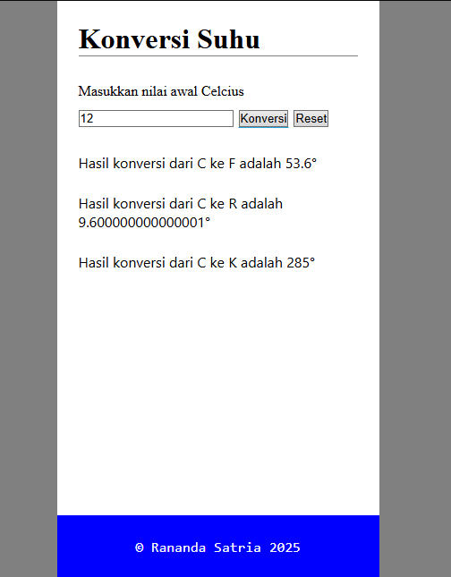

# Temperature Converter Form Input with Javascript DOM

This project is a simple JavaScript application that dynamically converts temperatures from Celsius to Fahrenheit, Reamur, and Kelvin using DOM manipulation and form input. 

 It demonstrates the power of DOM manipulation and basic JavaScript calculations, making it an excellent learning tool for beginners in web development or anyone interested in creating functional web applications.

## Preview



## Getting Started
1. Clone this project:
```
git clone https://github.com/ranandasatria/fgo24-dom-basic
```

2. Install the depedencies:
```
npm install
```

3. Run the project:
```
npm run dev
```

4. The project will be runnning at:
``` 
http://localhost:8080
```

## Depedencies

This project uses Node.js. Make sure you have Node.js installed on your machine.

- live-server: to simulate an HTTP server in a local environment.

## How to contribute

Please open a Pull Request (PR) to contribute to this project.
Your PR will be reviewed and merged if necessary.

## License

This project following MIT License.

## Copyright
&copy; 2025 Kodacademy


